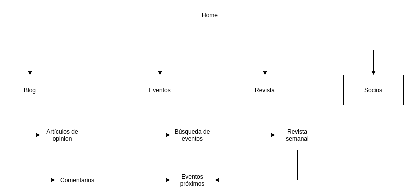
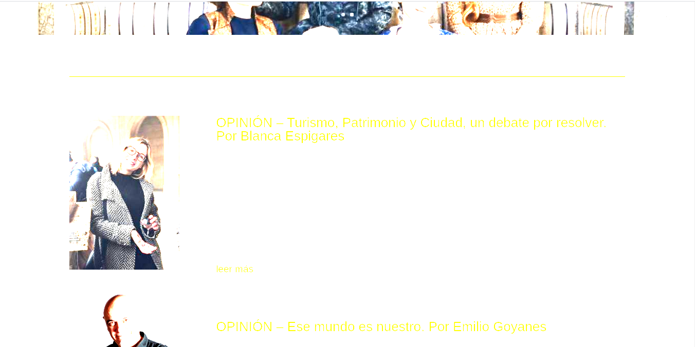
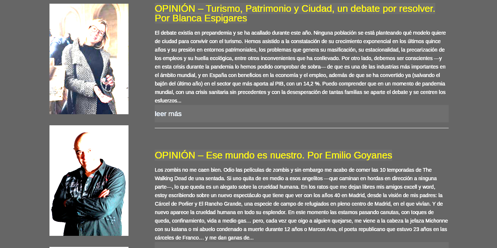

# Trabajo final: Resolución de un problema, caso y/o supuesto práctico

| **Autor**       | Pablo Cordero Romero                                                   |
|-----------------|------------------------------------------------------------------------|
| **Repositorio** | [github.com/corderop/DIU_FINAL](https://github.com/corderop/DIU_FINAL) |

## Parte 1: Mi experiencia UX

En primer lugar, creo que una de las cosas más importantes que me ha aportado la asignatura, ha sido el análisis de usabilidad del producto desde el punto de vista de los usuarios. Muchas veces desde nuestra posición de desarrollo y creación, solemos creer inconscientemente en que si nosotros o alguien cercano a nosotros no tiene problemas con un diseño de producto, otras personas tampoco los tendrán. He conseguido entender y aprender como de importante es aplicar diferentes puntos de vista a la hora de desarrollar un diseño. El haber aprendido todo esto aplicado a casos reales me ha hecho comprender tanto errores comunes como prácticas existosas. Además la aplicación de herramientas dirigidas al ámbito del diseño, desde cuestionarios hasta herramientas de prototipado me han permitido poner en práctica todo lo aprendido. 

Ejercicios como el de etnografía, permiten ponerse de forma extrema en un lugar en el que muchas veces estamos sin darnos cuenta. Al fin y al cabo como desarrolladores y como diseñadores muchas veces partimos de la posición en la que se presenta "GURB" en este ejercicio, una posición en la que podemos creer que el mal uso de un producto es culpa del que lo usa y no del que lo diseña. Pensando en problemas reales y observando los realizados por los compañeros comprendes que los diseños vagos son algo bastante común en nuestra sociedad actual.

Ejercicios como el de usabilidad o accesibilidad me introdujeron a herramientas no conocidas, como los ranking de usabilidad usados, o las herramientas para "ponerse en el lugar" de gente con problemas de accesibilidad. 

En cuanto a las prácticas, el aprendizaje vino principalmente a partir de los fallos en el proceso de realización. La primera práctica, al principio enfocamos la práctica más en reflejar los fallos ya encontrados de la alternativa analizada en lugar de desarrollar perfiles que nos permitiesen encontrar estos y otros problemas. Al darnos cuenta que lo habíamos pensado de forma errónea, enfocamos el ejercicio de forma que se cubriese un perfil más casual y uno menos común. Además de todo esto, haber utilizado herramientas como el Usability Review creo que será útil en un contexto futuro.

La segunda práctica, creo que ha sido en la que más he aprendido. Esta fue enfocada por mi grupo con una visión de implementación más que una visión de ideación. Nos centramos en idear el producto desde un punto de vista ténico más que de diseñó. Tanto la malla receptora de información como la propuesta de valor, fue rellenada con funcionalidades que creíamos que era interesante corregir o añadir a nuestra solución de producto. Creo que esto es algo común que ocurre desde el punto de vista más técnico desde el que solemos partir, siendo algo que creo haber aprendido a controlar con la asignatura. Pensar primero en el producto y no en la funcionalidad hace tener más claro el diseño final y como este va a estar enfocado a los diferentes usuarios. En esta misma práctica, también quiero destacar que me ha sido de utilidad aprender herramientas como el sitemap, la cual nos permitió crear una visión conceptual del diseño que queríamos realizar, pudiendo reflexionar como las partes de un producto están relacionadas.

Tanto la práctica 3 como sus apartados referentes de teoría me permitió analizar como muchas veces, de forma inconsciente, damos un significado al diseño como usuarios de este. El tipo de tipografía, el significado del color, la iconografía, y muchos detalles más, permiten dar un significado indirecto a la gente acerca de tu producto. Esto hará que a partir de ahora reflexione mucho más acerca de mis elecciones de diseño y de como estas se reflejan en base al mensaje o significiado que quiero dar.

Por otra parte, esta práctica, me permitió conocer en profundidad el concepto de patrón de diseño y guideline. Es curioso como durante tanto he estado usando aplicaciones donde muchas partes seguían un mismo patrón que en mi cabeza se reflejaba como un estandar de facto, es decir, más como una "corriente de diseño actual" que como un patrón establecido. 

En cuanto a la práctica 4, lo más valioso de todo lo aprendido lo asocio a conocer las herramientas para evaluar diferentes alternativas de diseño y a ponerlas en el contexto adecuado.

Además de todo esto, la realización de las prácticas en grupo me ha hecho aprender habilidadades blandas como son la puesta en común de ideas, debate sobre las soluciones a adoptar y la coordinación y trabajo en grupo.

Además de todo esto me gustaría destacar la metodología de enseñanza de la asignatura que ha permitido aprendar de una forma más práctica todos los conceptos presentados. Es algo diferente a lo que normalemente estamos acostrumbrados y ha sido de especial agrado. 

En general, creo que la asignatura me ha aportado bastantes conocimientos importantes que complemetan de una forma muy interesante en una carrera enfocada mucho más a un aspecto más técnico.

## Parte 2: Caso de estudio web YUZIN

### 1: Análisis

Para determinar si la alternativa es correcta, analizaré esta desde diferentes puntos. El primero desde la usabilidad haciendo un usability review que me permita dar una valoración basada en diferentes puntos contrastados. Por otra parte analizaré el diseño visual mediante medidas de contraste y utilizando otras herramientas. Finalmente analizaré la accesibilidad para diferentes tipos de problemas.

#### Usability review

El [Usability Review](./usability-review.pdf) nos da una puntuación de 66 sobre 100. Aun sin ser muy alta, he de decir que me ha sorprendido debido a que esperaba una puntuación más baja. Realizando esta revisión he encontrado ciertos puntos a analizar:

* Las búsquedas, a pesar de permitir parámetros avanzados, no ofrecen resultados relacionadas con lo introducido. Los resultados mostrados son casi siempre los mismos, no se si por motivos de patrocinio o por el mecanismo de búsqueda
* La estructura de la página no es algo que quede claro. No se diferencian las diferentes secciones de esta y no queda claro como está dividida la página.
* La página no se adapta bien a diferentes dispositivos, ni diferentes navegadores.
* No se resaltan correctamente las partes y herramientas princpales de la página, como podría ser la sección de búsqueda

#### Diseño visual

El diseño visual he querido resaltarlo ya que tanto los colores como la tipografía de la aplicación son de las primeras cosas que me han llamado la atención. En primero lugar se utiliza el amarillo y el negro como colores principales, sobre un fondo blanco. En negro sobre el blanco y el negro sobre el amarillo ofrecen un contraste correcto, analizados mediante la herramienta [WebAIM: Contrast Checker](https://webaim.org/resources/contrastchecker/). Aun con esto, en ocasiones utilizan negros con transparencia sobre el amarillo, como se puede ver en el navbar cosa que empeora el contraste. Por acabar de comentar los colores, en la web queda clara los colores que marcan la identida visual, pero viendo su revista, esta no está clara ya que utilizan varios colores diferentes. Creo que deberían buscar unificar esto.

En cuanto a la tipografía, creo que utilizan una tipografía muy plana. Al entrar en la web, no me da la sensación de que sean una revista. Quizas proprondría la utilización de una tipografía de tipo Serif para el contenido de los textos, normalmente utilizadas por revistas y periódicos y quizas otra de tipo Sans-serif para los títulos.

#### Accesibilidad 

He analizado la web con la herramienta [Web Disability Simulator](https://chrome.google.com/webstore/detail/web-disability-simulator/olioanlbgbpmdlgjnnampnnlohigkjla?hl=en) en diferentes patologías. He obtenido la siguiente experiencia: 

* **Daltonismo**: La página se ver de forma correcta, en base debido al correcto contraste entre negro, amarillo y blanco comentado anteriormente.
* **Parkinson**: No sería tampoco demasiado problema. Los botones y links son lo suficientemente grandes para poder ser pulsados por personas con estos problemas.
* **Dislexia**: Al estar todo acompañado por imágenes, muchas de los artículos o eventos pueden ser identificables. Por otra parte, las secciones si pueden ser algo difíciles de entender ya que esto no está acompañado de símbolos que permitan identificarlo.
* **Problemas de visión muy clara**: Para estos usuarios puede ser o muy incómodo o imposible acceder a la página. Al estar todo formado por los colores amarillo y blanco, estos solo podrán disringuir textos con fondo oscuro, los cuales son minoritarios. Se podría solucionar con un fondo ocuro.

### Paso 2: Propuesta de soluciones

Para la propuesta de soluciones en primer lugar en base a lo analizado en el Usability Review creo que sería interesante analizar y proponer nuevas ideas mediante una malla receptora de información: 

| Interesante / Relevante                                                                                                                                                                                   | Críticas constructivas                                                                                                          |
|-----------------------------------------------------------------------------------------------------------------------------------------------------------------------------------------------------------|---------------------------------------------------------------------------------------------------------------------------------|
| <ul><li>Búsqueda y reserva de eventos</li><li>Artículos de opinión</li><li>Creación de eventos por parte de terceros</li></ul>                                                                            | <ul><li>Estructurar la página de forma clara</li><li>Sección de ayuda al usuario</li></ul>                                                            |
| **Preguntas a partir de la experiencia**                                                                                                                                                                  | **Nuevas ideas**                                                                                                                |
| <ul><li>¿Cómo puedo vender entradas a través de yuzin?</li><li>¿Puedo ver los eventos próximos?</li><li>¿Puedo utilizar las entradas compradas desde mi móvil?</li><li>¿Se me notificará cuando se acerque la fecha de mi evento?</li></ul> | <ul><li>Digitalización en forma de web de la revista tradicional</li><li>Mostrar eventos próximos</li><li>Comentarios y valoraciones de eventos y artículos</li><li>Separación del blog y la web de eventos</li></ul> |

A partir de esta propuesta, buscando organizar mejor la web, ofrecería una alternativa de **Sitemap** conceptual con el que se buscaría organizar de mejor forma la web y separar las diferentes partes de la plataforma:

#### Diseño visual

En cuanto a la revisión del diseño conceptual, mis decisiones acerca de este, como he comentado en el primero apartado irían enfocadas a dar una identidad única a ambos productos, tanto web como revista. Partiendo de esta idea, creo que el esquema de colores de la web funciona de forma correcta y le proporciona una marca de identidad. Estos los aplicaría de igual forma a la revista. 

En cuanto a la tipografía, aplicaría un estilo más serif para textos buscando dar un estilo de revista a la web. Un ejemplo podía ser la fuente de letra Merriweather, tipografía Sans-serif pero que no genera una alta sensación de seriedad como otras del mismo tipo:

#### Accesibilidad

Tras lo analizado anteriormente, la página no es una mala solución en cuanto a accesibilidad. El único grupo de personas con necesidades especiales que he encontrado que podrían tener problemas con la web son las personas con problemas de visión clara. Para estos sería bueno que la página tuviese un modo oscuro que facilitase su visión, reduciendo la aparición de colores claros. Tal y como está diseñada la página actual, un usuario con estas características vería la página tal que así:

Añadiendo los fondos más oscuros, el contraste será mayor, tanto de títulos como de textos, lo que facilitaría la visión y navegación para estas personas. Un ejemplo podría ser el siguiente:

